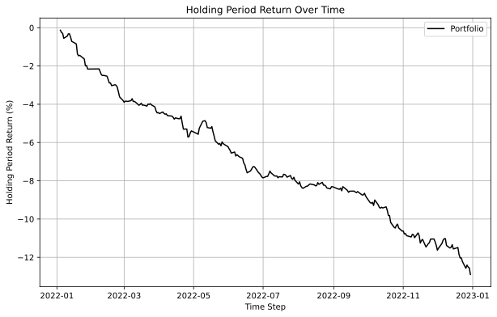
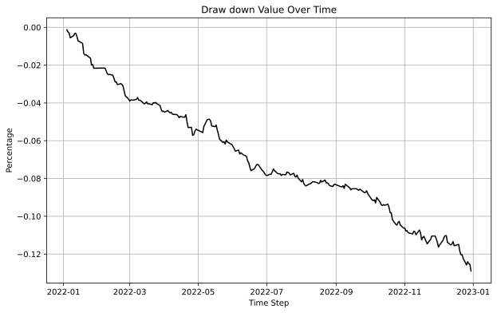
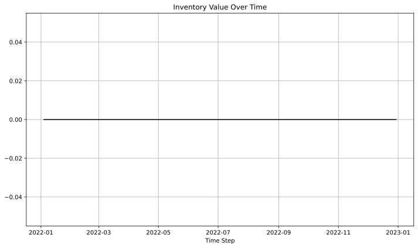
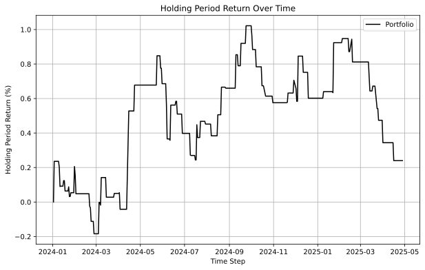
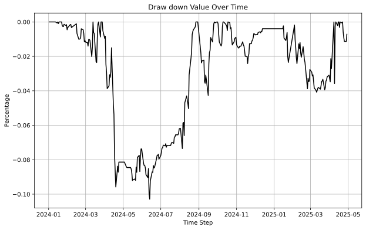
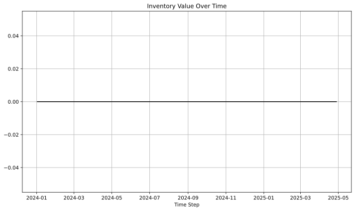

# VWAP-Anchored EMA Momentum Strategy (VAEM-v4)

## Abstract

This project implements a VWAP-Anchored EMA Momentum strategy (VAEM-v4) designed for intraday trading on Vietnam's VN30F1M futures contract. The strategy combines multiple technical indicators—EMA crossovers, session-anchored VWAP, RSI momentum filters, and ATR-based dynamic stop-loss/take-profit—with a long-term trend regime filter to avoid trading against sustained market movements. The algorithm includes risk management features such as a daily loss circuit breaker and post-stop-loss cooldown periods to limit drawdowns during adverse market conditions.

## Introduction

Momentum-based trading strategies that rely solely on short-term EMA crossovers often suffer significant drawdowns during sustained trending markets, as they continue generating signals against the prevailing trend. The November 2022 Vietnam real-estate/bond market crisis demonstrated this vulnerability when traditional EMA crossover strategies repeatedly hit stop-losses during the sustained VN30 crash.

Our VAEM-v4 strategy addresses this challenge by implementing a multi-layered approach:

1. **Trend Regime Filter**: A slow EMA(50) filter that only permits long entries when price is above this trend line (uptrend) and short entries when below (downtrend)
2. **Daily Circuit Breaker**: Halts all new entries when intraday realized P&L drops below a threshold (-3 index points)
3. **Post-Stop-Loss Cooldown**: Prevents immediate re-entry after stop-losses to avoid revenge trading into trending moves

The strategy aggregates tick data into 15-minute OHLCV bars to reduce noise and ensure ATR values are meaningful for fee coverage. Entry signals combine EMA(9)/EMA(21) crossovers with VWAP confirmation, RSI momentum filters, and volume confirmation, while exits use ATR-based dynamic take-profit (3x ATR) and stop-loss (1x ATR) levels.

## Related Work

Readers are recommended to explore the following resources for background on the technical indicators and concepts used in this strategy:

- **VWAP Trading**: [Investopedia - VWAP](https://www.investopedia.com/terms/v/vwap.asp)
- **EMA Crossover Strategies**: [Investopedia - EMA](https://www.investopedia.com/terms/e/ema.asp)
- **RSI Indicator**: [Investopedia - RSI](https://www.investopedia.com/terms/r/rsi.asp)
- **ATR for Position Sizing**: [Investopedia - ATR](https://www.investopedia.com/terms/a/atr.asp)
- **Algotrade Knowledge Hub**: [9-Step Process](https://hub.algotrade.vn/knowledge-hub/steps-to-develop-a-trading-algorithm/)

## Trading Hypothesis

### Core Strategy Logic

The VAEM-v4 strategy is built on the hypothesis that EMA crossovers combined with VWAP confirmation and trend regime filtering can identify high-probability momentum entries while avoiding trading against sustained market trends.

#### Entry Conditions

**Long Entry** (all conditions must be met on completed 15-min bars):

- EMA(9) crosses above EMA(21)
- Bar close > Session VWAP
- Bar close > EMA(50) (regime filter: uptrend only)
- 50 ≤ RSI(14) ≤ 70 (momentum zone, avoiding overbought)
- Bar volume ≥ 1.2 × Average Volume(20)
- ATR(14) ≥ 1.5 points (minimum volatility threshold)
- Not in cooldown period and daily loss limit not reached

**Short Entry** (all conditions must be met on completed 15-min bars):

- EMA(9) crosses below EMA(21)
- Bar close < Session VWAP
- Bar close < EMA(50) (regime filter: downtrend only)
- 30 ≤ RSI(14) ≤ 50 (momentum zone, avoiding oversold)
- Bar volume ≥ 1.2 × Average Volume(20)
- ATR(14) ≥ 1.5 points
- Not in cooldown period and daily loss limit not reached

#### Exit Rules (priority order)

1. **Take-Profit**: Unrealized P&L ≥ +3.0 × ATR(14) × Multiplier
2. **Stop-Loss**: Unrealized P&L ≤ -1.0 × ATR(14) × Multiplier (triggers 3-bar cooldown)
3. **Signal Reversal**: EMA(9) crosses back through EMA(21) against position
4. **Overnight Rule**: Force-close any open position at ATC (end of day)

#### Risk Management Features

- **Time Filter**: Only accept new entries on bars closing between 09:15 and 14:15 local time
- **Daily Loss Circuit Breaker**: Halt all new entries if intraday realized P&L drops below -3 index points
- **Post-Stop-Loss Cooldown**: Skip 3 bars after any stop-loss before allowing new entries
- **Position Size**: 1 contract at all times

### Strategy Parameters

| Parameter                 | Value | Description                            |
| ------------------------- | ----- | -------------------------------------- |
| `BAR_MINUTES`             | 15    | Aggregate ticks into 15-minute candles |
| `EMA_FAST_PERIOD`         | 9     | Fast EMA period (135 minutes)          |
| `EMA_SLOW_PERIOD`         | 21    | Slow EMA period (315 minutes)          |
| `EMA_TREND_PERIOD`        | 50    | Trend regime filter (~12.5 hours)      |
| `RSI_PERIOD`              | 14    | RSI calculation period                 |
| `ATR_PERIOD`              | 14    | ATR calculation period                 |
| `ATR_TP_MULT`             | 3.0   | Take-profit multiplier                 |
| `ATR_SL_MULT`             | 1.0   | Stop-loss multiplier                   |
| `ATR_MIN_POINTS`          | 1.5   | Minimum ATR threshold for entries      |
| `VOL_MA_PERIOD`           | 20    | Volume moving average period           |
| `VOL_THRESHOLD`           | 1.2   | Volume confirmation threshold          |
| `COOLDOWN_BARS`           | 3     | Post-stop-loss cooldown bars           |
| `DAILY_LOSS_LIMIT_POINTS` | -3.0  | Daily circuit breaker threshold        |

## Data

### Data Collection

The input data consists of tick-level trading data for VN30F1M and VN30F2M futures contracts. The data includes:

| Column         | Description                                                              |
| -------------- | ------------------------------------------------------------------------ |
| `datetime`     | Timestamp with millisecond precision (format: `YYYY-MM-DD HH:MM:SS.fff`) |
| `date`         | Trading date (format: `YYYY-MM-DD`)                                      |
| `price`        | Last traded price                                                        |
| `close`        | Daily closing price                                                      |
| `best-bid`     | Best bid price                                                           |
| `best-ask`     | Best ask price                                                           |
| `spread`       | Bid-ask spread                                                           |
| `volume`       | Trade volume (optional)                                                  |
| `tickersymbol` | Contract symbol                                                          |

**Data Sources:**

1. **Sample Data**: Pre-loaded CSV files in `data/is/` (in-sample) and `data/os/` (out-of-sample) folders
2. **Database**: Configure your database connection in `.env` file:

```
DB_HOST=<host or ip>
DB_PORT=<port>
DB_NAME=<database name>
DB_USER=<username>
DB_PASSWORD=<password>
```

### Data Processing

The strategy processes raw tick data as follows:

1. **Load F1M and F2M contract data** from CSV files or database
2. **Merge datasets** on datetime with forward-fill for missing values
3. **Round decimal columns** to ensure precision consistency
4. **Aggregate ticks into 15-minute OHLCV bars** during backtesting runtime
5. **Handle F1 → F2 roll-over** on expiration weeks automatically

The data period configuration is set in `parameter/backtesting_parameter.json`:

```json
{
  "is_from_date_str": "2022-01-01 00:00:00",
  "is_end_date_str": "2023-01-01 00:00:00",
  "os_from_date_str": "2024-01-02 00:00:00",
  "os_end_date_str": "2025-04-29 00:00:00",
  "fee": "0.4",
  "time": "15"
}
```

## Implementation

### Environment Setup

**Requirements:** Python 3.10+ must be installed. Detailed guide on how to install Python can be found in the official [Python guide](https://docs.python.org/3/using/index.html).

1. **Clone the repository and navigate to the project directory:**

```bash
git clone https://github.com/hdkhoaapcs22/CS408-22125009-22125038-Mean-Reversion.git
cd CS408-22125009-22125038-Mean-Reversion
```

2. **Create and activate a virtual environment:**

```bash
# Create virtual environment
python -m venv venv

# Activate (macOS/Linux)
source venv/bin/activate

# Activate (Windows)
.\venv\Scripts\activate.bat
```

3. **Install dependencies:**

```bash
pip install -r requirements.txt
```

### Project Structure

```
├── backtesting.py          # Main backtesting module with VAEM-v4 strategy
├── evaluation.py           # Out-of-sample evaluation script
├── optimization.py         # Optuna-based parameter optimization
├── utils.py                # Helper functions
├── data_loader.py          # Data loading utilities
├── price_util.py           # Price utility functions
├── config/
│   └── config.py           # Configuration loader
├── parameter/
│   ├── backtesting_parameter.json    # Backtesting configuration
│   ├── optimization_parameter.json   # Optimization settings
│   └── optimized_parameter.json      # Best parameters from optimization
├── metrics/
│   └── metric.py           # Performance metrics calculation
├── data/
│   ├── is/                 # In-sample data
│   │   ├── VN30F1M_data.csv
│   │   └── VN30F2M_data.csv
│   └── os/                 # Out-of-sample data
│       ├── VN30F1M_data.csv
│       └── VN30F2M_data.csv
├── database/
│   ├── data_service.py     # Database service
│   └── query.py            # SQL query utilities
└── result/
    ├── backtest/           # In-sample backtesting results
    └── optimization/       # Optimization results
```

### Configuration

#### Backtesting Parameters (`parameter/backtesting_parameter.json`)

```json
{
  "is_from_date_str": "2022-01-01 00:00:00",
  "is_end_date_str": "2023-01-01 00:00:00",
  "os_from_date_str": "2024-01-02 00:00:00",
  "os_end_date_str": "2025-04-29 00:00:00",
  "fee": "0.4",
  "time": "15"
}
```

#### Optimization Parameters (`parameter/optimization_parameter.json`)

```json
{
  "random_seed": 2025,
  "no_trials": 100,
  "step": [1, 5]
}
```

### Running the Strategy

#### In-Sample Backtesting

```bash
python backtesting.py
```

#### Optimization

```bash
python optimization.py
```

#### Out-of-Sample Evaluation

```bash
python evaluation.py
```

## In-Sample Backtesting

### Configuration

- **Data Period**: January 1, 2022 to January 1, 2023
- **Initial Capital**: 500,000,000 VND
- **Contract Multiplier**: 100 VND per index point
- **Fee per Trade**: 40 VND per contract

### Command

```bash
python backtesting.py
```

### Result

The results are saved in `result/backtest/` folder:

| Metric           | Value |
| ---------------- | ----- |
| HPR              | 0.8%  |
| Annual Return    | 1.7%  |
| Monthly Return   | 0.16% |
| Maximum Drawdown | -1.1% |
| Sharpe Ratio     | -3.41 |
| Sortino Ratio    | -5.09 |

**Holding Period Return (HPR) Chart:**



**Drawdown Chart:**



**Inventory Chart:**



## Optimization

### Methodology

We use [Optuna](https://optuna.org/) with the Tree-structured Parzen Estimator (TPE) sampler to optimize the `step` parameter. The objective function maximizes the annualized Sharpe ratio.

### Configuration

```json
{
  "random_seed": 2025,
  "no_trials": 100,
  "step": [1, 5]
}
```

### Command

```bash
python optimization.py
```

### Result

The optimization process finds the best parameter set that maximizes the Sharpe ratio:

| Parameter | Optimized Value |
| --------- | --------------- |
| `step`    | 3.1             |

Optimization logs are saved in `result/optimization/optimization.log.csv`.

## Out-of-Sample Backtesting

### Configuration

- **Data Period**: January 2, 2024 to April 29, 2025
- **Initial Capital**: 500,000,000 VND
- **Optimized Parameters**: `step = 3.1`

### Command

```bash
python evaluation.py
```

### Result

The results are saved in `result/optimization/` folder:

| Metric           | Value    |
| ---------------- | -------- |
| HPR              | 0.24%    |
| Annual Return    | 0.087%   |
| Monthly Return   | 0.00807% |
| Maximum Drawdown | -0.78%   |
| Sharpe Ratio     | -5.65    |
| Sortino Ratio    | -7.69    |

**Holding Period Return (HPR) Chart:**



**Drawdown Chart:**



**Inventory Chart:**



## Conclusion

The VAEM-v4 strategy demonstrates the importance of combining multiple technical indicators with robust risk management mechanisms. The key improvements from previous versions include:

1. **Trend Regime Filter (EMA-50)**: Prevents trading against sustained market trends, which was the primary cause of losses during the November 2022 market crash
2. **Daily Circuit Breaker**: Caps single-day losses to prevent cascading drawdowns
3. **15-Minute Bar Aggregation**: Reduces noise and ensures ATR values are meaningful relative to trading fees
4. **Post-Stop-Loss Cooldown**: Prevents revenge trading into trending adverse moves

Future work could explore:

- Dynamic position sizing based on volatility
- Multi-timeframe analysis for improved trend identification
- Machine learning-based regime detection

## Reference

1. Algotrade Knowledge Hub - 9-Step Process: https://hub.algotrade.vn/knowledge-hub/steps-to-develop-a-trading-algorithm/
2. Investopedia - VWAP: https://www.investopedia.com/terms/v/vwap.asp
3. Investopedia - EMA: https://www.investopedia.com/terms/e/ema.asp
4. Investopedia - RSI: https://www.investopedia.com/terms/r/rsi.asp
5. Investopedia - ATR: https://www.investopedia.com/terms/a/atr.asp
6. Optuna Documentation: https://optuna.org/
